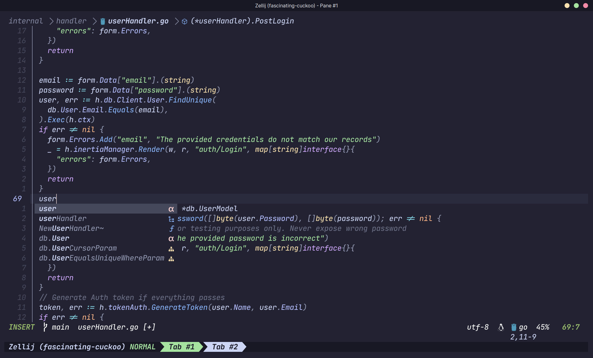

# Neovim With Lazy Package Manager

Neovim IDE built for web development


### :sparkles: Features
- Support for multiple languages
- VsCode like complete menu with icons
- Catpuccin theme
- improved code folding with ufo
- Improved notifications with mini.nvim
- Amazing Fuzzy searches with Telescope
- Treesitter syntax highlighting

This config is greatly inspired by [kickstart.nvim](https://github.com/nvim-lua/kickstart.nvim)


# Installation
Make sure that you have >= neovim0.9 installed

Have these languages installed on your system:
- Go
- Node
- PHP
- Python

Next we need to install python and node support

- Neovim python support

  ```sh
  pip install pynvim
  ```

- Neovim node support

  ```sh
  npm i -g neovim
  ```

We will also need `ripgrep` for Telescope to work:

- Ripgrep

  ```sh
  sudo apt install ripgrep
  ```
  or
  ```sh
  brew install ripgrep
  ```

## Install the config

Make sure to remove or backup your current `nvim` directory

```sh
git clone https://github.com/codedbyshoe/nvim.git ~/.config/nvim
```
run `nvim` to install all the plugins

## Check health for missing dependencies

Open `nvim` and enter the following:

```
:checkhealth
```
